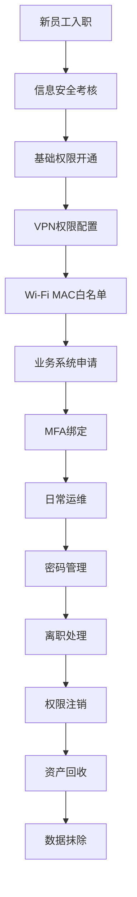

import Tabs from '@theme/Tabs';
import TabItem from '@theme/TabItem';

# 企业账户管理体系设计与实施指南 (SOP)
---
## 一、适用范围与设计目标

### 适用对象
本指南适用于全球范围内所有层级正式员工、实习生及IT运维团队全体成员。

### 管理范围
涵盖基础办公协同工具（Google Workspace、Slack）、零信任网络边界（aTrust VPN、办公Wi-Fi）、核心业务系统（FS系统）及硬件认证令牌（YubiKey）的全流程管理。

### 设计目标
严格落实"最小权限原则"与"零信任架构"要求，通过技术防控手段（MFA硬件认证、MAC网关白名单）与规范化合规流程（权责分离、严格审批），实现企业账户全生命周期的安全可控、可追溯管控。

## 二、前置条件与责任分工

1. **系统与资源就绪**：IT部门需提前对Google Workspace等核心SaaS服务的授权（License）资源进行动态监控，当授权数量接近上限时，须及时清理冗余账号，确保资源合理分配。

2. **权责分离 (Maker-Checker)**：持有高级管理权限的IT人员（如Ethan、Sofer、Derek等），仅可执行账号常规开启、关闭操作，严禁私自修改用户密码或进行越权赋权操作。

3. **合规准入要求**：所有新入职员工必须参加InfoSec部门组织的信息安全考核，考核成绩需达到80分及以上方可通过准入，未达标人员需重新参加考核，直至合格。

## 三、实施规范：账户全生命周期管理

### 阶段一：入职开通与权限下发 (Onboarding)

新员工账户开通工作需严格遵循"基础权限标配、特殊权限按需申请"的核心原则，确保权限分配合理、合规。

1. **通用基础权限分配**：
   - 为新员工统一分配Google企业邮箱，并同步开通Slack办公通讯权限，保障基础办公协同需求。

2. **核心网络权限开通 (aTrust VPN)**：
   - **命名规范**：VPN账号备注信息中严禁出现中文姓名，确保账号管理的规范性与统一性。
   - **动态路由映射**：根据员工岗位职能定向分配VPN访问域名，国内办公人员默认开通`backoffice.vpnnetwork.cn:10443`；开发及测试岗位人员定向开通`devops.vpnnetwork.cn:10443`。

3. **办公Wi-Fi MAC地址加白**：
   - **操作要求**：收集员工办公设备真实MAC地址，在AC控制器后台完成信息备注（需明确区分公司资产设备与员工私人设备），并执行MAC地址白名单添加操作。
   - **风险规避**：针对iOS、macOS系统设备，须强制要求员工关闭"私有Wi-Fi地址"功能，避免因地址动态变更导致白名单失效，影响正常联网。

4. **业务系统申请 (FS系统)**：
   - **操作要求**：FS系统权限非默认开通，需由员工提交正式邮件申请，经所在部门负责人审批通过后，抄送IT运维部门及员工直属上级，IT部门确认审批流程无误后，方可完成账号创建及权限分配。

### 阶段二：零信任安全与强身份认证 (Authentication)

全面废除传统单因素密码认证模式，推行基于物理硬件与动态口令相结合的多因素认证（MFA）机制，强化账户身份认证安全性。

1. **Google账号物理防钓鱼绑定 (YubiKey)**：
   - **强制绑定要求**：所有员工须将YubiKey 5C NFC设备绑定为Google账号二次验证凭证，严禁选择"创建通行密钥"（规避iCloud及云端密码管理器同步带来的信息泄露风险），须唯一选择"使用安全密钥"完成绑定。
   - **资产追溯管理**：YubiKey设备发放时，IT运维人员需核对设备背面S/N码，并与公司资产编号进行绑定录入资产管理系统；员工领取设备后，需通过邮件发送收件确认函，留存审计追踪记录。

2. **VPN动态令牌认证**：
   - **操作要求**：员工首次登录aTrust VPN系统时，须强制通过Google Authenticator工具扫码绑定TOTP动态口令，完成二次认证后，方可正常访问VPN资源。

### 阶段三：密码变更与权限运维 (Maintenance)

**核心风险点**：本阶段为账户安全管控高风险环节，易发生越权操作及社会工程学攻击，所有操作须严格执行身份验证与分级审批流程。

1. **系统密码重置红线（Google/系统级）**：
   - **禁止私下操作**：IT运维人员接到员工通过私人Slack或口头提出的密码重置请求时，须第一时间向直属上级（Bruce Zhang）报备，严禁擅自执行重置操作。
   - **合规审批流程**：员工需完成身份核实后，向其直属上级提交密码重置正式申请，并抄送IT运维公共邮箱（it@tron.network）；IT运维部门确认审批流程完整、合规后，方可执行密码重置操作。
   - **强制修改机制**：IT运维人员仅可发放高强度临时密码，密码发放后须立即提醒员工登录对应系统，完成临时密码更换，设置个人专属密码。

2. **办公Wi-Fi密码重置**：
   - **操作要求**：在AC控制器后台执行Wi-Fi密码重置操作时，须勾选"登录时必须修改初始密码"选项，确保密码安全性。
   - **强制引导要求**：临时密码发放后，若员工未自动跳转至密码修改页面，IT运维人员需指导员工访问强制验证门户（http://2.2.2.1），完成新密码设置。

### 阶段四：离职注销与资产回收 (Offboarding)

离职员工账户及资产处理是阻断企业数据外流的关键环节，所有操作须严格遵循"优先切断通信渠道、再阻断核心数据访问"的执行顺序。

1. **权限阻断顺位**：
   - **第一步（通信阻断）**：立即注销离职员工Slack账号，同时禁用并删除其公司企业邮箱，切断对外通信渠道。
   - **第二步（业务与网络阻断）**：移除离职员工1Password、Microsoft Office 365及EasyConnect/aTrust VPN等系统的访问权限，阻断核心业务及网络资源访问。

2. **硬件资产无害化回收**：
   - **操作要求**：回收离职员工所持YubiKey设备后，IT运维人员须通过YubiKey Manager工具执行全协议重置操作（含OTP、FIDO2、PIV协议），彻底清除设备内原员工加密凭据，完成无害化处理后，方可重新入库分配。

3. **回购设备数据抹除**：若离职员工申请回购公司配发MacBook设备，须由IT运维部门进行物理数据抹除操作，并通过邮件确认抹除结果；远程离职员工需配合IT部门通过视频连线全程监督操作，拒不配合者，取消设备回购资格。

## 四、异常处理机制 (Exception Handling)

| 异常场景 | 规避方案与处理动作 |
|---------|------------------|
| **YubiKey PIN码多次输错导致账号锁定** | **严禁直接解锁放行**。IT运维部门需将该账号移入"特殊账户"管理组，强制清除原有密钥绑定记录，通知用户重新完成硬件密钥绑定操作后，方可解锁账号。 |
| **YubiKey遗失** | 用户需立即通过备用MFA验证方式登录Google账号管理页面，删除遗失设备对应的安全密钥记录，同时向IT运维部门提交报备申请，申领新的YubiKey设备并完成绑定。 |
| **用户反馈无法连接Wi-Fi且无法打开 `2.2.2.1`** | 指导用户排查并确认设备网络列表中"私有MAC地址"功能已彻底关闭，IT运维人员同步在AC控制器后台二次核查MAC地址白名单配置，确认无误后协助用户恢复联网。 |

---

## 流程概览

---
## 关键风险控制点

<Tabs className="tabs-with-border">
  <TabItem value="权限管理风险" label="权限管理风险">
    **风险描述**：越权操作、权限滥用可能导致数据泄露或系统安全事件。
    
    **防控措施**：
    - 严格执行Maker-Checker机制
    - 实施最小权限原则
    - 定期权限审计与清理
  </TabItem>
  <TabItem value="身份认证风险" label="身份认证风险">
    **风险描述**：弱密码、MFA配置不当可能导致账户被非法访问。
    
    **防控措施**：
    - 强制使用硬件MFA（YubiKey）
    - 实施强密码策略
    - 定期密码更换要求
  </TabItem>
  <TabItem value="离职流程风险" label="离职流程风险">
    **风险描述**：离职员工未及时注销权限可能导致数据泄露。
    
    **防控措施**：
    - 严格执行离职权限阻断顺位
    - 硬件资产无害化回收
    - 回购设备数据抹除
  </TabItem>
</Tabs>