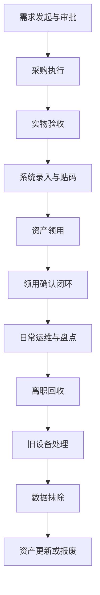

import Tabs from '@theme/Tabs';
import TabItem from '@theme/TabItem';

# 企业 IT 资产全生命周期管理标准作业程序 (SOP)

---

## 适用范围
本 SOP 适用于公司全球范围内所有 IT 实体资产（如 MacBook、YubiKey 硬件密钥、考勤机等）及网络虚拟授权（如系统 License）的采购、入库、领用、运维与回收淘汰管理。

## 责任分工 (Maker-Checker 机制)

严格遵循"账实分离"与"职能分立"原则：

| 部门/角色 | 职责 |
|----------|------|
| **采购部** | 负责供应商寻源、比价与合同签订 |
| **各地区行政（如当地 Admin）** | 负责资产的实物签收、核对清点与拍照存档 |
| **IT 资产专员** | 负责线上台账的录入与维护，确保数据精准无误 |
| **业务/需求方** | 负责发起真实的采购申请（PR），并完成实物或服务的最终验收 |

## 前置条件

- **系统准备**：IT 需建立统一的资产管理表或录入系统，并配备标准的资产编号标签（如 XCBJQT013）
- **合规审批**：任何采购支出必须在系统内提交采购申请（PR），并完成业务与财务审批

## 核心操作步骤

### 阶段一：采购与入库 (Procurement & Inbound)

1. **需求发起与审批**：业务方提交 PR，由采购部执行集中采购或授权自采。**严禁无预算或未走流程先执行采购**。

2. **实物验收（以海外分支机构为例）**：
   - 供应商发货至当地办公室后，由当地行政（如 Teresa）负责实物确认，收集设备序列号（S/N）并拍摄清晰的资产照片
   - 行政将资产信息通过邮件同步给 IT 资产负责人（如 Ethan）

3. **系统录入与贴码**：
   - IT 资产负责人将信息录入资产台账，上传图片
   - 对于特殊硬件（如 YubiKey），需核对背面的 S/N 码，并贴上对应的公司资产编号（Asset Tag）

### 阶段二：资产领用与权限绑定 (Distribution & Provisioning)

1. **实物发放**：员工入职或申请时，由当地行政或 IT 发放实物设备。

2. **领用确认闭环（关键步骤）**：
   - 员工收到资产后，**必须发送领用确认邮件**至 it@tron.network 进行确认
   - **规范模板**：邮件需包含"领取日期、设备名称、设备 S/N 码、补充资料、地区"。IT 凭此邮件在台账中更新状态为"已领用"

3. **强绑定备案**：对于 YubiKey，员工须将设备照片及 S/N 码发送给 IT 及区域管理员备案，并强制绑定至核心系统账号。

### 阶段三：日常运维与盘点 (Maintenance & Audit)

1. **故障监控**：每周召开 IT 全员会，通报各地区软硬件故障及资产台账异常情况。

2. **员工自采垫付报销**：若员工因业务紧急垫付采购 IT 资产（如 YubiKey），需提供订单及支付截图、实物照片，并与行政/IT 办理资产入库登记，取得签字版入库单后方可提交 FS 系统报销。

### 阶段四：离职回收与淘汰流转 (Offboarding & Disposal)

1. **离职权限阻断**：按序注销 Slack/公司邮箱，随后移除 1Password、Office 365 及 VPN 等核心权限。

2. **硬件无害化回收**：
   - 收回的 YubiKey 必须由 IT 执行全协议重置（包括 OTP、FIDO2、PIV），彻底清除前员工凭证后方可重新入库

3. **旧设备回购/报废（核心红线）**：
   - **物理数据抹除**：员工申请回购旧 MacBook 等设备前，**必须由当地 IT 人员进行物理数据抹除处理**
   - **审计留痕**：IT 必须邮件正式回复财务"数据已清理完毕"，财务方可推进扣款回购流程
   - **远程监管**：若员工远程办公，IT 必须通过视频连线全程监督数据清理。拒不配合者，一律取消回购资格

---

## 注意事项与风控规避

<Tabs className="tabs-with-border">
  <TabItem value="采购合规风险" label="采购合规风险">
    **风险描述**：若业务方未经授权"先斩后奏"直接采购，IT 拒绝常规入库与付款。
    
    **规避方案**：必须判定为 Bypass，要求需求人发起特殊申请，经"一级部门负责人 + CEO"邮件审批后方可推进流程。
  </TabItem>
  <TabItem value="账实不符风险" label="账实不符风险">
    **风险描述**：IT 人员既负责台账维护又负责实物盘点，存在舞弊风险。
    
    **规避方案**：必须坚持行政管"物"，IT 管"账"的防舞弊原则。
  </TabItem>
  <TabItem value="数据外泄风险" label="数据外泄风险">
    **风险描述**：因旧电脑回购引发的企业数据泄露是高危风险。
    
    **规避方案**：必须严格执行"未清数据不放行"的一票否决制。
  </TabItem>
</Tabs>

---

## 异常处理机制

| 异常类型 | 处理措施 |
|---------|----------|
| **资产遗失/损坏** | 员工需第一时间向 IT 报备，若是安全密钥（YubiKey）丢失，IT 需立即从系统后台（如 Google Admin）移除该安全密钥，防止外部恶意登录 |
| **收货信息不匹配** | 若行政在验收时发现 S/N 码与采购单不符或外观破损，应立即原路退回并冻结入库流程，由采购部介入与供应商交涉 |

---

## 流程概览

