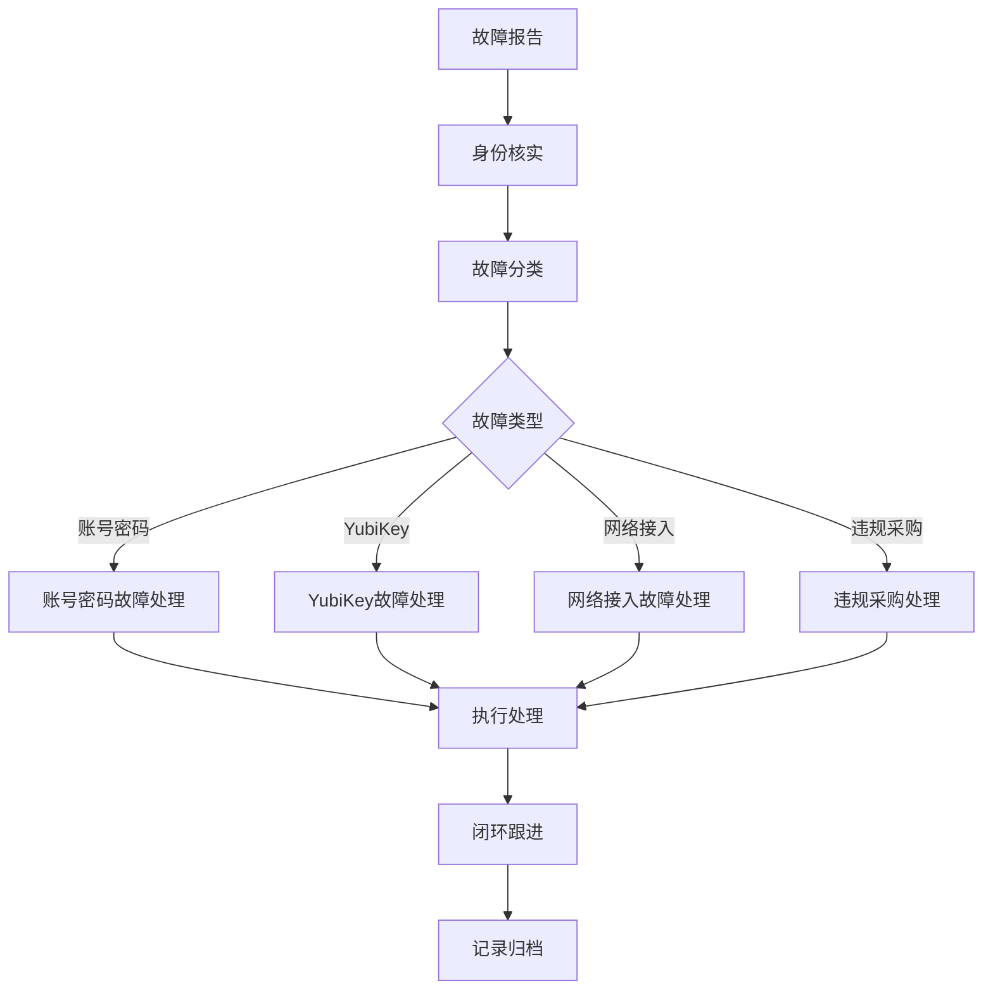

import Tabs from '@theme/Tabs';
import TabItem from '@theme/TabItem';

# 🚨 企业 IT 系统故障响应与处理机制标准作业程序 (SOP)

## 一、适用范围

本 SOP 适用于公司全球范围内的 IT 系统故障响应与运维处理，核心覆盖身份认证系统（Google Workspace、YubiKey）、网络接入系统（aTrust VPN、办公 Wi-Fi）、终端资产数据处理及合规审计模块。

## 二、前置条件与责任分工

1. **身份核实前提**：IT 人员在接收到任何账号或权限级别的故障处理请求时，**必须首先确认申请人的账号是否为其本人所有，且申请人确系本人**。

2. **权责分离红线 (Maker-Checker)**：拥有 Tron 邮箱权限的系统管理员（如 Ethan、Sofer、Derek 等），仅限按照入职离职流程处理账户的开关，**绝对不允许私自修改用户密码或执行其他越权操作**。

## 三、核心故障排查与操作步骤

<Tabs>
  <TabItem value="账号与密码系统故障" label="场景 1：账号与密码系统故障（高危）">
    **故障表现**：用户遗忘密码、被锁定，或通过私人 Slack 直接要求 IT 修改密码。
    
    **操作步骤**：
    1. **拦截违规请求**：接到私人 Slack 密码重置请求时，IT 人员需第一时间向负责人 `Bruce Zhang` 汇报，确认是否要求用户发送正式邮件重置。
    2. **发起标准审批**：要求用户向其**直属领导**发送重置密码请求邮件，并**务必抄送至公邮 `it@tron.network`**。
    3. **执行重置**：仅在获得直属领导邮件许可后，IT 管理员方可为用户重置为**高强度临时密码**。
    4. **闭环跟进**：密码重置完成后，IT 必须立即提醒用户及时登录系统更换为个人高强度密码。
  </TabItem>
  
  <TabItem value="YubiKey故障" label="场景 2：YubiKey 硬件认证与二次验证故障">
    **故障表现**：YubiKey 遗失，或因 PIN 码输入错误导致账号锁定。
    
    **操作步骤**：
    1. **设备锁定处理**：若因 PIN 码错误导致锁定，IT 需将该用户账号移至**"特殊账户"组**，以清除原有的密钥记录，并协助用户重新进行绑定。
    2. **设备遗失阻断**：若用户丢失 YubiKey，需指导或协助用户及时进入 Google 账号管理页面，**立即移除该安全密钥**以防止风险。
    3. **重置与初始化**：对于回收或出现异常的 YubiKey，需通过 PC 端 `YubiKey Manager` 执行全协议重置（包括 OTP、FIDO2、PIV 协议）。
  </TabItem>
  
  <TabItem value="网络接入故障" label="场景 3：网络接入故障 (aTrust VPN & Wi-Fi)">
    **故障表现**：用户无法连接内网 Wi-Fi，或 aTrust VPN 客户端登录失败。
    
    **VPN 故障排查**：
    1. 核查接入域名：确认用户未误用旧版 IP，中国大陆办公须使用 `https://backoffice.vpnnetwork.cn:10443`，开发与测试人员须使用 `devops` 专属域名。
    2. 核查账号规范：检查用户 aTrust 账号备注中**是否违规出现了中文名字**，若有需立即修正。
    3. 核验 TOTP：检查用户是否已在首次登录时通过 Google Authenticator 成功扫描二维码并绑定动态令牌。
    
    **Wi-Fi 故障排查**：
    1. MAC 白名单核对：检查设备真实 MAC 地址是否已在 AC 控制器加白。
    2. 终端私有地址排查：对于 macOS 或 iOS 设备，**必须强制要求用户将 Wi-Fi 设置中的"私有 Wi-Fi 地址"设置为"关闭"或"固定"**，否则白名单将失效。
    3. 强制重置密码流程：若需重置 Wi-Fi 密码，IT 需在 AC 后台为用户设置简单临时密码，并**必须勾选"登录时必须修改初始密码"**。通过 Slack 告知用户后，若未自动弹出改密窗口，需引导用户使用 Safari 浏览器访问 `http://2.2.2.1` 提交个人复杂密码。
  </TabItem>
  
  <TabItem value="业务违规采购" label="场景 4：业务违规采购与报销 (Bypass) 异常">
    **故障表现**：业务部门未在系统提交 PR（采购申请）即形成实际履约或要求付款。
    
    **处理步骤**：采购部判定为 Bypass（采购绕过）行为，此属不合规行为。如公司仍需完成付款，必须要求需求人发起特殊申请，经**一级部门负责人及 CEO 邮件审批**后，方可继续推进付款流程。
  </TabItem>
</Tabs>

## 四、离职阻断与数据安全 (Offboarding)

预判数据泄露风险点，员工离职时，IT 必须严格按照以下顺序操作：

1. **优先阻断通讯**：注销 Slack 账号并禁用/删除公司邮箱。
2. **撤销业务系统权限**：移除 `1Password`、`Microsoft Office 365` 及 `aTrust/EasyConnect VPN` 的访问权限。
3. **硬件安全回收**：收回 YubiKey 并由 IT 执行全协议重置。

## 五、注意事项与风险规避

1. **数据抹除红线 (旧设备回购)**：员工申请回购旧 MacBook 时，**必须由当地 IT 人员进行物理数据抹除处理**。若员工不回公司（远程），IT **必须通过远程视频全程监督其完成数据清理**；拒不配合者，严禁回购。IT 必须通过邮件正式回复财务"数据已清理完毕"，流程方可进入扣款环节。

2. **入职准入红线**：所有新员工必须通过由 `infosec@tron.network` 发送的安全考试，成绩低于 **80 分**者需重新参加，否则不可放行完整系统权限。

## 六、附则：常态化审计与复盘机制

1. **周报与例会复盘**：IT 团队每周需在"印象笔记"提交本周总结与下周计划，并在全员周会上通报各地区软硬件故障及网络异常情况，提炼根因。

2. **Slack 权限审计**：每周五，IT 必须手动执行审计，将 Slack 内部公开的组频道强制调整为私人频道，收缩信息暴露面。

## 故障响应流程图

